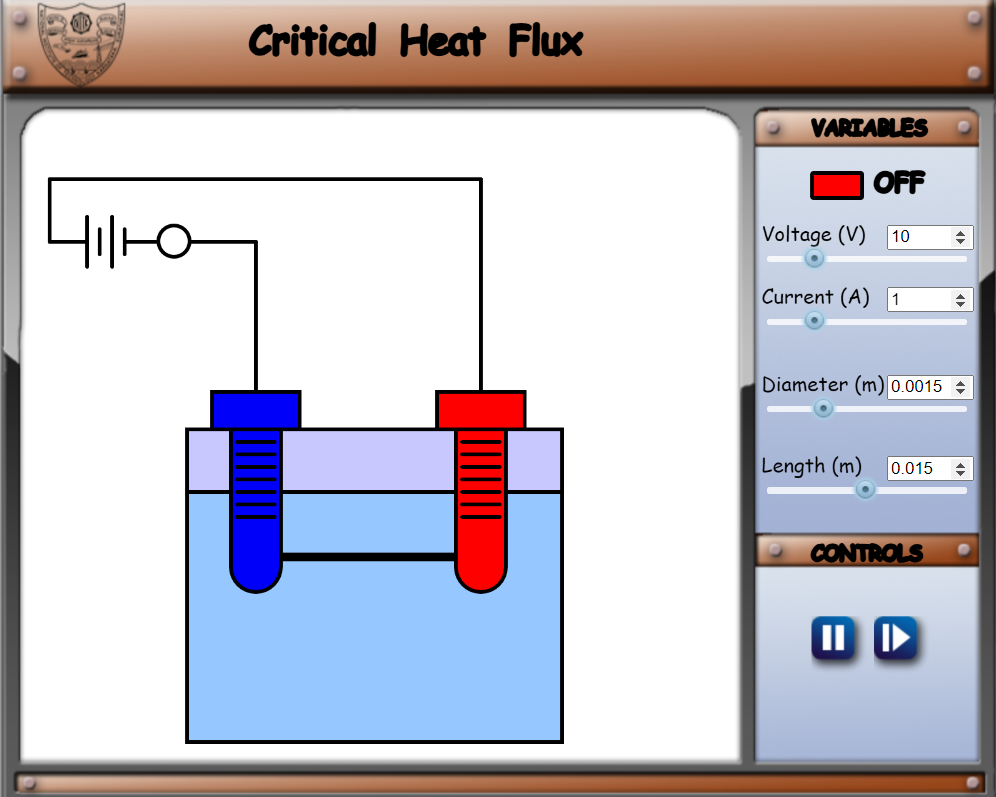
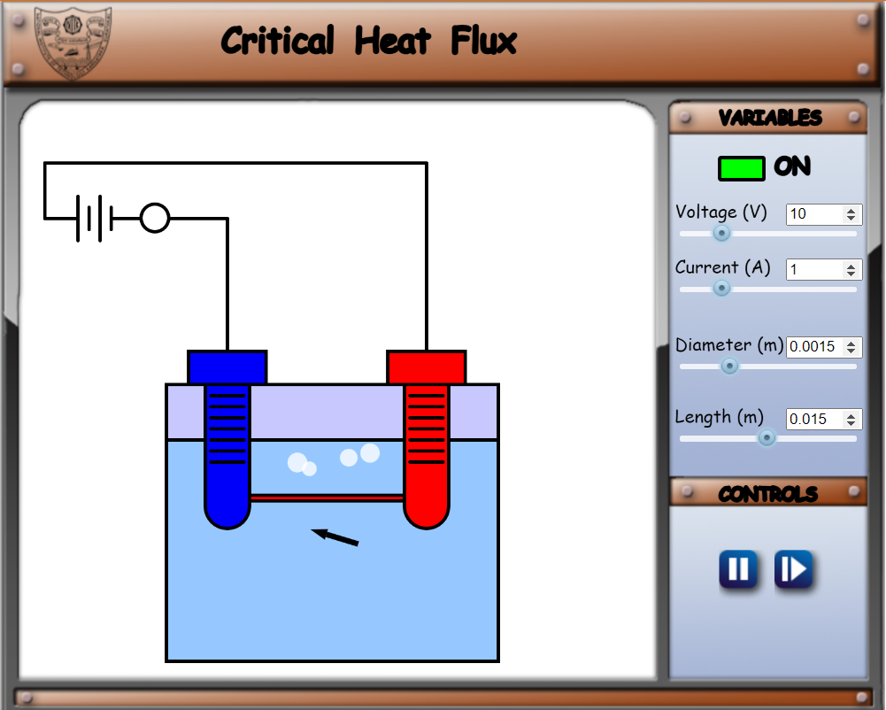
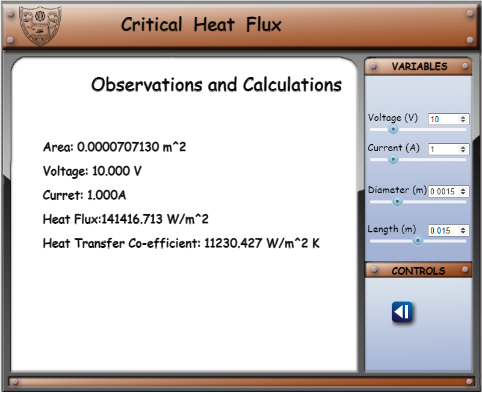

1. Clicking on the simulation tab will open the following figure showing the simulator turned off, then click on the red coloured button and set appropriate variables 

   

2. Click on the play button and the simulation will begin. 

   

3. Click on the next page button to view the results. 

   
