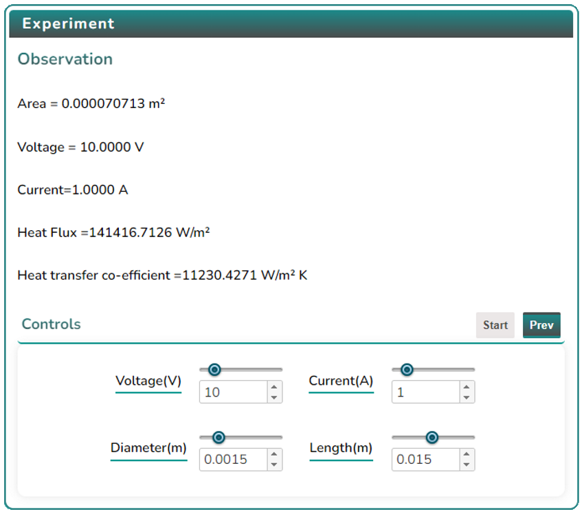

### Procedure

1. Click on the Objective icon  to view the objective of the simulation.

   

2. Click on the Description icon  to view the description of the simulation.

   

3. Click on the Experiment icon  to view the experimental setup.

   

4. Click on Start button    to perform the experiment, click on the Next button  to move to the observation page.

   

