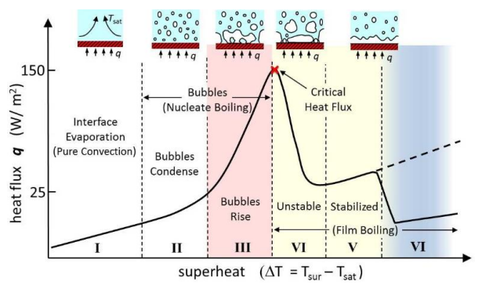

Boiling is the term used to describe the quick change from a liquid to a gas. During this experiment, boiling occurs when a solid is submerged in a drink at a temperature higher than the saturation temperature of the liquid. An external coil provides heat, reducing the time it takes for the liquid to reach the boiling point through the wire. The boiling curve depicted in Fig. 1 demonstrates the various stages the liquid goes through before it turns into vapor.

Fig. 1 Boiling Curve

The graph can be divided into three regions: 
1.	Pure convection region: In this region, heat transfer happens due to the difference in densities of hot and cold liquids.
2.	Nucleate boiling region: Bubbles are formed at some locations where the lighter fluid collapse due to the higher-density fluid on its top. The temperature increases to such a point that it rises to the top.
3.	Film Boiling region: In some extreme cases where there is no way for the bubbles to escape, it collapses on the metal surface and becomes a film, which may facilitate heat transfer through radiation.
The initiation of film boiling indicates the highest peak point in Fig. 1 i.e., the critical heat flux, beyond which the heat flux steadily decreases due to thermal resistance with the formation of the vapor film. 

The experimental apparatus contains:
1.	Electrodes
2.	Nichrome wire 
3.	Power Supply
4.	Voltmeter 
5.	Ammeter 
6.	Closed Container
7.	Heater Coil

The closed container houses a heater coil and the nichrome wire fixtures which are connected to a power source. The ammeter and the voltmeter indicate the voltage and the current passing through the nichrome wire. As mentioned before the heater coil gives the initial heat till the fluid (in this case, water) reaches a certain temperature. Voltage and current values are changed and noted periodically until the wire breaks at which point the critical heat flux of the wire is calculated.    

Formulae:
1. Heat Input, Q (Watts) = Volts (V) x Current (I)
2. Critical Heat Flux, qc (W/m2) = Q/ &pi; x Diameter (d) x Length (L)  